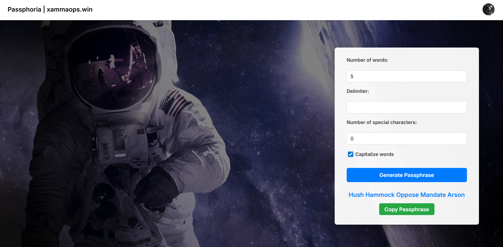

# Passphoria
My own API implementation for passphrase generating using the diceware logic.  

You can read more about it here: https://en.wikipedia.org/wiki/Diceware  

Using the diceware API for python: https://diceware.readthedocs.io/en/stable/index.html

## Demo



## Installation
Use my helm-chart for deploying it to a Kubernetes cluster.  
Change the values accordingly, e.g. if you want to use an Ingress and its annoation etc.  

```bash
helm repo add xammahelm https://xamma.github.io/helm-charts
helm repo update
helm search repo xammahelm

helm install passphoria-rel xammahelm/passphoria -f values.yaml -n passphoria --create-namespace
```

## Dev-Setup
For development
```bash
source .venv/bin/activate
pip install -r src/requirements.txt
cd src/main
flask --app main run
```

Or just run the container image.  

## Usage
You can use the UI at the website hosted at **https://passphoria.xammaops.win** or use the RestAPI:

### Get a passphrase with default values
```bash
curl --location --request POST 'https://passphoria.xammaops.win/api/passphrase'
```
Which gives you a nice passphrase:
```json
{
    "passphrase": "Glance Buddhist Bagged Daisy Roundish"
}
```

### Get a passphrase with custom values
```bash
curl --location 'http://localhost:5000/api/passphrase' \
--header 'Content-Type: application/json' \
--data '{
    "num": 3,
    "delimiter": "#",
    "specials": 2,
    "caps": false
}'
```

Which will return a response like this:
```json
{
    "passphrase": "gal7antly#labored#saucines^"
}
```

### Defaults
These are the default values used by the API:
```bash
num: 5   # Number of words the passphrase contains
delimiter: ' '  # Use an empty string as delimiter
specials: 0  # Dont use any special characters
caps: true # Capitalize the words
```